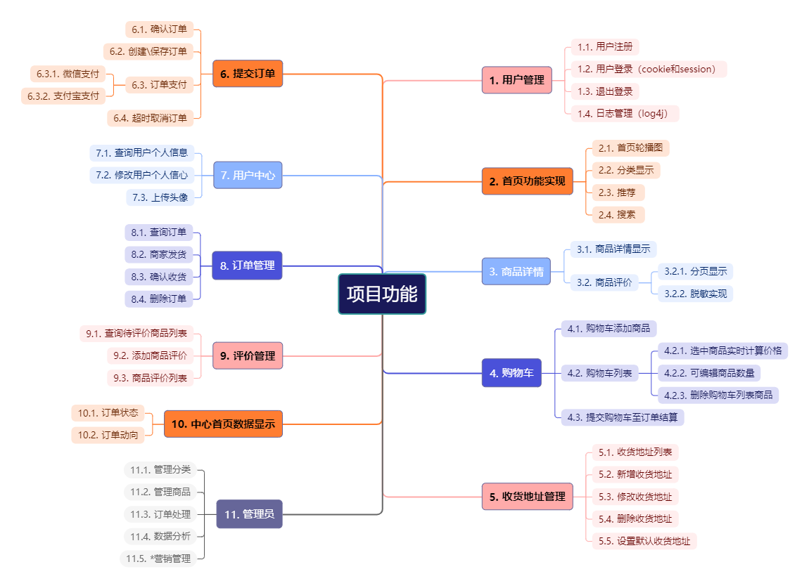
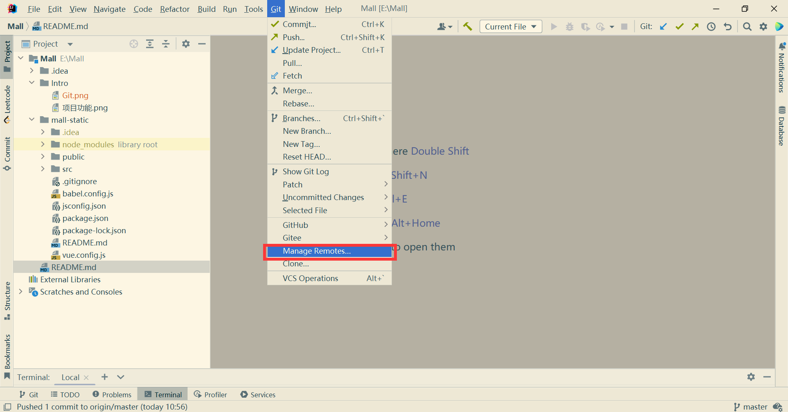
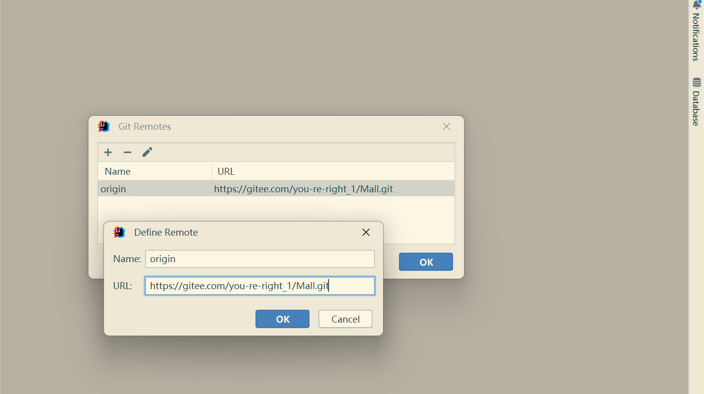
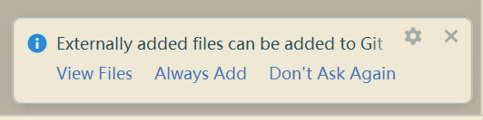
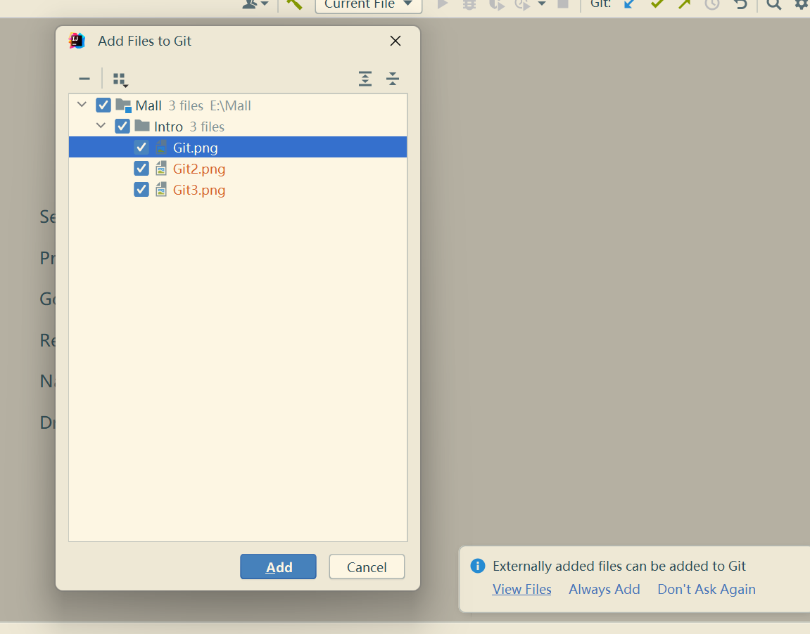
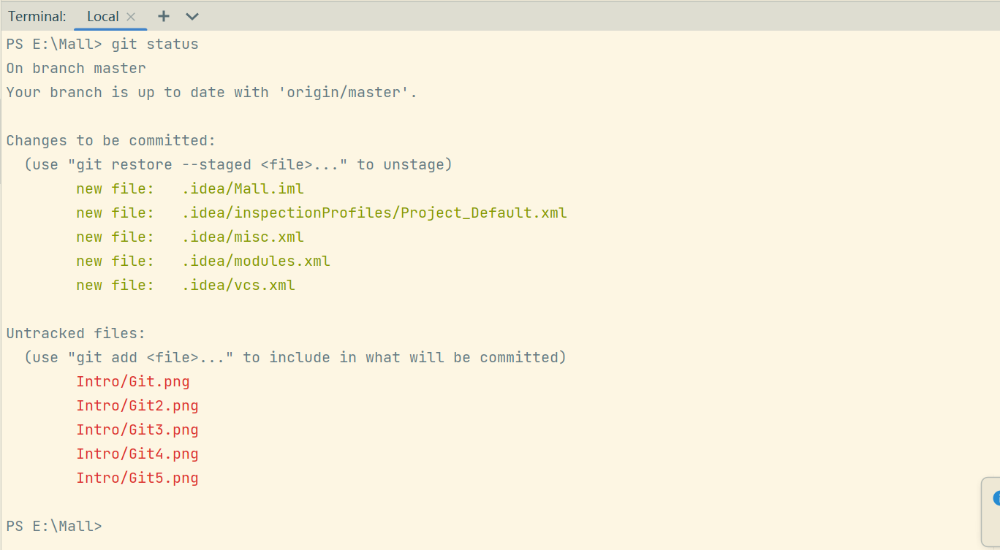
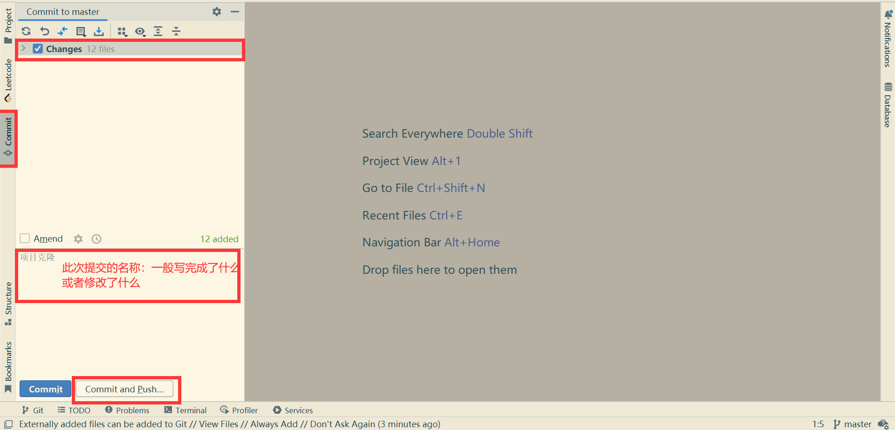
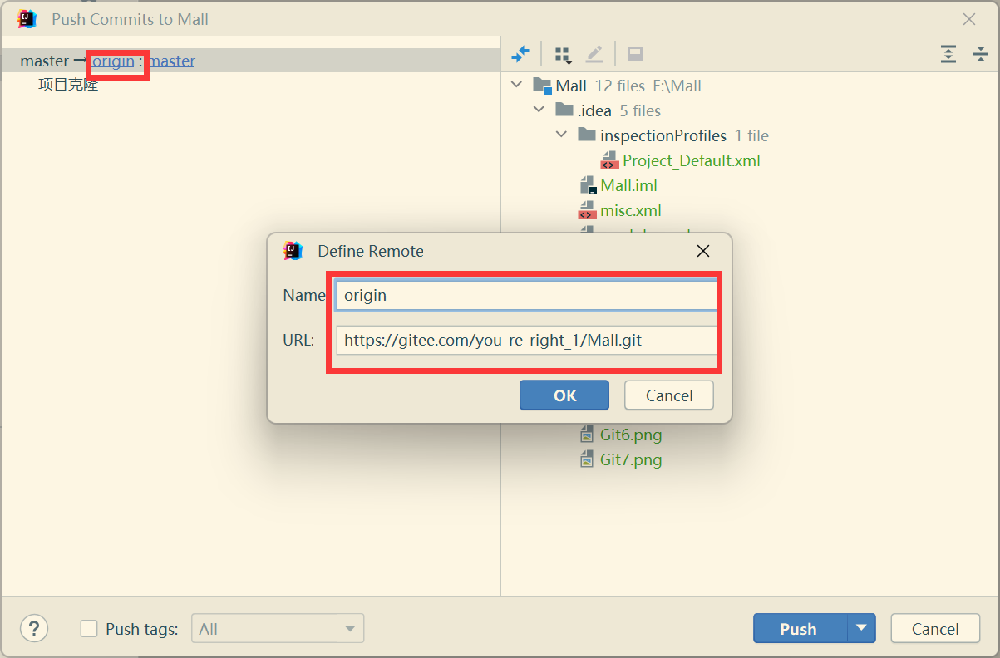
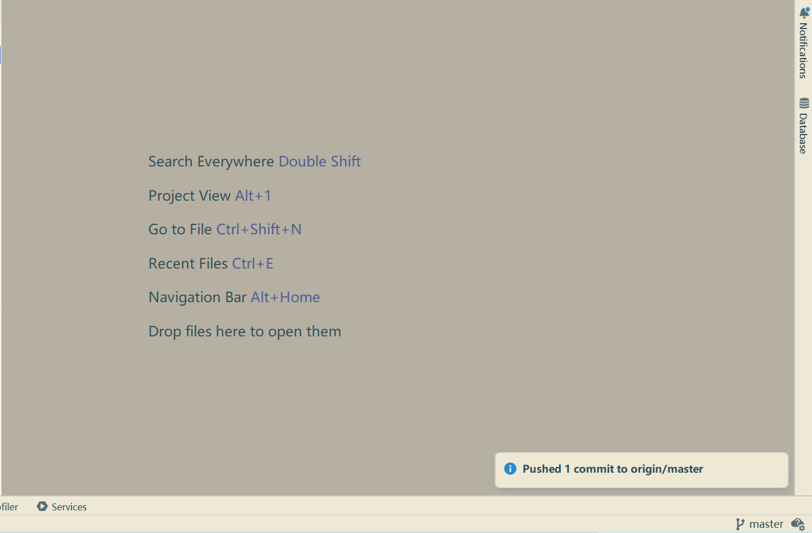

#### 介绍

项目功能图：
 

数据库ER图：

  

#### Idea中使用Gitee
1，git clone https://gitee.com/you-re-right_1/Mall.git
(git bash here中shift+insert键代表粘贴)

2，克隆到本地后
mall-static文件夹为前端内容，前端采用Vue（确保安装了node.js），所以在mall-static下：
npm install 结束后生成node_modules文件夹
运行Vue
方法1：npm run serve
方法2：控制台输入vue ui，在可视化界面中管理vue项目
成功运行，看到首页面即可

------------------！！！重要！！！--------------------

修改项目前一定要先git pull，以免提交造成冲突

------------------！！！重要！！！--------------------

3，（如果熟悉git命令能够提交可以不用看下面，下面是idea中简单的git 操作）

idea中
File----->Settings----->Plugins---->安装Gitee插件，安装完成后，在左侧Version Control中找到gitee绑定账号，
同理下载git插件，菜单栏中出现Git ，如下图所示：

 
这里可以定义远程仓库的地址：

 
branch和url：

 

idea会检测到新增添的文件：

 

View File可以选择你具体想添加哪些文件，Always Add就是都添加git add -A：

 

git status可以显示工作目录和暂存区的状态：

 

左侧commit里可以完成git add，git commit，git push，Changes里面可以勾选要git add哪些文件，中间写提交的名称,写完后进行commit或者直接commit and push：

 

点击后，弹出这个消息框，如果没有manage Remotes过就定义一下，已经定义过的不用管，确定是要提交的仓库地址就可以了：

 

Push成功后，右下角提示成功，返回gitee仓库页面也能看到提交的新文件：

 

#### 软件架构
技术清单
项目架构：前后端分离
前端技术：Vue、Axios、Bootstrap
后端技术：SpringBoot+MyBatis、RESTful、Swagger
服务器搭建：Linux、Nginx

项目搭建：基于Maven的聚合工程（？？？）完成项目搭建，前端采用vue+axios，后端使用SpringBoot整合SSM

#### 开发步骤

1问题定义/提出问题

2可行性分析（技术体系能否实现，成本，法律法规，灰色地带）商务运作，关系运作

3需求采集及分析

4 概要设计

    系统设计（技术选型，架构模式）

    数据库设计

    UI设计

    功能流程设计

5详细设计

	实现步骤（业务流程实现细节）

6编码

        根据设计好的实现步骤进行代码实现

7测试

	开发过程中，开发者要进行单元测试

	集成测试

        功能测试（黑盒测试）

        性能测试（白盒测试）极限，压测

8交付/部署实施

#### 安装教程

1.  xxxx
2.  xxxx
3.  xxxx

#### 使用说明

1.  xxxx
2.  xxxx
3.  xxxx

#### 参与贡献

1.  Fork 本仓库
2.  新建 Feat_xxx 分支
3.  提交代码
4.  新建 Pull Request

